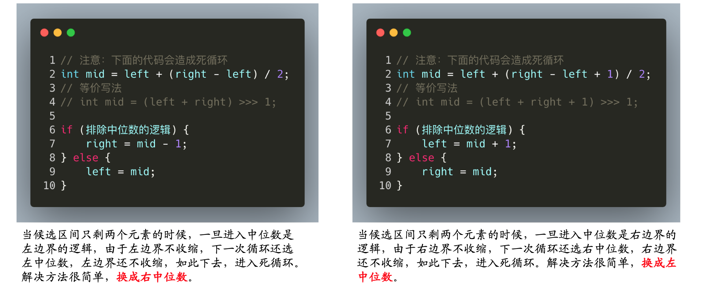
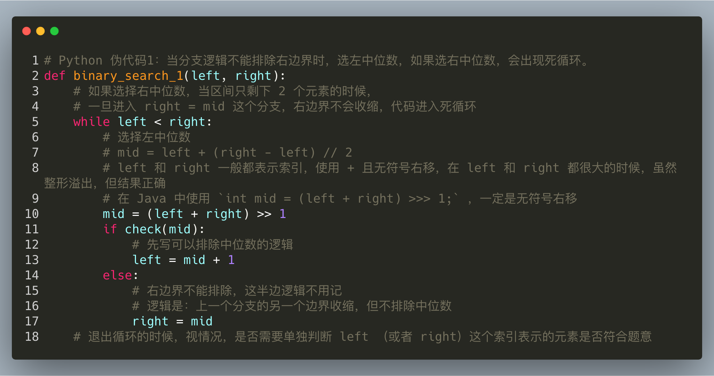
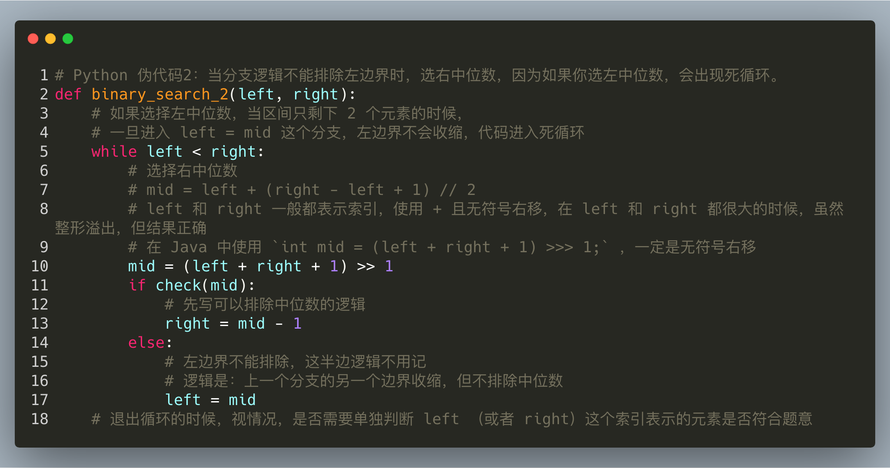

# 二分查找笔记

### 传统“二分法”存在的问题
1. 取中位数时溢出
```Java
// 问题代码
int mid = (left + right) / 2 ;

// 第一次修改
// 依然存在问题：right为正，left为负时，right-left依然可能溢出。（只不过left和right表示数组索引时无影响）
int mid = left + (right - left) / 2 ;

// 更好的写法
int mid = (left + right) >>> 1 ;
// 在 Java 中，无符号右移运算符 >>> 和右移运算符 >> 的区别如下：
// 1. 右移运算符 >> 在右移时，丢弃右边指定位数，左边补上符号位
// 2. 无符号右移运算符 >>> 在右移时，丢弃右边指定位数，左边补上 00，也就是说，
//    对于正数来说，二者一样，而负数通过 >>> 后能变成正数
```

2. 循环条件为 `while(left <= right)` 时，在退出循环时，需要考虑返回 `left` 还是 `right`，容易出错

### 改进后的二分查找法
1. 循环条件改为 `while(left < right)`，则退出循环时，一定有 `left==right`，此时返回 `left` 或者 `right` 都行

2. 基本思想：
> **“排除法”即：在每一轮循环中排除一半以上的元素，于是在对数级别的时间复杂度内，就可以把区间“夹逼” 只剩下 1 个数，而这个数是不是我们要找的数，单独做一次判断就可以了。**

### 算法细节
1. 思考左、右边界，如果左、右边界不包括目标数值，会导致错误结果。注意两点：
	1. **索引是否越界**，如果 `left` 和 `right` 表示的是数组的索引，就要考虑“索引是否有效” 。
	2. **左右边界一定要包括目标元素**，例如 LeetCode 第 35 题：“搜索插入位置” ，当 `target` 比数组中的最后一个数字还要大（不能等于）的时候，插入元素的位置就是数组的最后一个位置 + 1，即 `(len - 1 + 1 )= len`，如果忽略掉这一点，把右边界定为 `len - 1` ，代码就不能通过在线测评。

2. 中位数先写 `int mid = (left + right) >>> 1 ;` 根据循环里分支的编写情况，再做调整，有两种中位数：
```Java
// 1. 当数组的元素个数是偶数的时候
int mid = left + (right - left) / 2 ;     // 得到左中位数的索引
int mid = left + (right - left + 1) / 2 ; // 得到右中位数的索引

// 2. 当数组的元素个数是奇数的时候，以上均可
```
```Java
// 一个例子：
// 当左边界索引 left = 3，右边界索引 right = 4 的时候
mid1 = left + (right - left) // 2 = 3 + (4 - 3) // 2 = 3 + 0 = 3，
mid2 = left + (right - left + 1) // 2 = 3 + (4 - 3 + 1) // 2 = 3 + 1 = 4。
// 左中位数 mid1 是索引 left，右中位数 mid2 是索引 right
```

3. 先写逻辑上容易想到的分支逻辑，这个分支逻辑通常是排除中位数的逻辑
> 实现 `int sqrt(int x)` 函数<br>
> 分析：因为题目中说“返回类型是整数，结果只保留整数的部分，小数部分将被舍去”。例如 55 的平方根约等于 2.2362.236，在这道题应该返回 22。因此如果一个数的平方小于或者等于 x，那么这个数有可能是也有可能不是 x 的平方根，但是能很肯定的是，如果一个数的平方大于 x ，这个数肯定不是 x 的平方根。

4. 循环内只写两个分支，一个分支排除中位数，另一个分支不排除中位数，循环中不单独对中位数作判断
> 既然是“夹逼”法，没有必要在每一轮循环开始前单独判断当前中位数是否是目标元素，因此分支数少了一支，代码执行效率更高。

5. 根据分支逻辑选择中位数的类型，可能是左中位数，也可能是右位数，选择的标准是避免死循环

> 1. 如果分支的逻辑，在选择左边界的时候，**不能排除中位数，那么中位数就选“右中位数”**，只有这样区间才会收缩，否则进入死循环；
> 2. 同理，如果分支的逻辑，在选择右边界的时候，**不能排除中位数，那么中位数就选“左中位数”**，只有这样区间才会收缩，否则进入死循环。

6. 退出循环的时候，可能需要对“夹逼”剩下的那个数单独做一次判断，这一步称之为“后处理”
	1. **如果你的业务逻辑保证了你要找的数一定在左边界和右边界所表示的区间里出现**，那么可以放心地返回 `left` 或者 `right`，无需再做判断；
	2. **如果不能保证，需要单独对最后一个数进行处理**

7. 取中位数的时候，要避免在计算上出现整型溢出

8. 编码一旦出现死循环，输出必要的变量值、分支逻辑是调试的重要方法

### 算法流程
1. 无脑写 `while(left < right)`

2. 先写排除中位数的逻辑分支（多数情况排除的逻辑比较好想，但是不绝对）

3. 根据分支情况选择是左中位数还是右中位数

4. 结合实际决定最后的数需不需要单独判断，编码过程注意避免死循环

### 二分法模版
1. 不能排除右边界时，选左中位数


2. 不能排除左边界时，选右中位数



### 参考文献
* [十分好用的二分查找法模板](https://leetcode-cn.com/problems/search-insert-position/solution/te-bie-hao-yong-de-er-fen-cha-fa-fa-mo-ban-python-/)