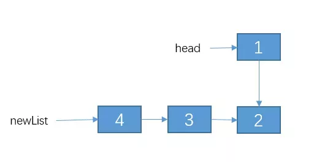

# 递归笔记

## 递归

### 递归三要素
1. 明确函数功能，确定函数原型
2. 确定递归结束条件
3. 找出递推公式。
```Java
// 1. 斐波拉契数列
f(n) = f(n-1) + f(n-2);

// 2. 反转单链表
Node newList = reverseList2(head.next);
Node t1  = head.next;
t1.next = head;
```
如果难以一眼看出递推公式，可以**假设前面已经完成了递归调用，当前这一轮应该怎么处理使递归进行下去**。例如在“反转单链表”问题中，可以假设前面的结点都已经反转了，当前结点是最后一个，怎么处理才能把递归接上。


### 优化
1. 考虑是否**重复计算**。例如求阶乘，可以把每次求得的结果放在数组或者HashMap中
```Java
// 我们实现假定 arr 数组已经初始化好的了。
int f(int n){
    if(n <= 1){
        return n;
    }
    //先判断有没计算过
    if(arr[n] != -1){
        //计算过，直接返回
        return arr[n];
    }else{
        // 没有计算过，递归计算,并且把结果保存到 arr数组里
        arr[n] = f(n-1) + f(n-1);
        reutrn arr[n];
    }
}
```
2. 考虑是否可以自底向上，将递归改为递推，**防止栈溢出**
```Java
public int f(int n) {
	if(n <= 2)
		return n;
	int f1 = 1;
	int f2 = 2;
	int sum = 0;
	// 递推
	for (int i = 3; i <= n; i++) {
		sum = f1 + f2;
	    f1 = f2;
	    f2 = sum;
	}
	return sum; 
}
```

## 动态规划

### DP三要素
1. **确定DP数组含义**
	* 此时还要确定下标范围，有时候下标为 `0...n` 方便，有时候下标为 `1...n+1` 方便
2. 确定状态转移方程，**立足于当前状态，思考是当前状态如何通过上一个状态得到的**
3. 找出初始条件
	* 哪些地方**不能用状态转移方程推导的**（例如，强行找出来的前一个状态对应的数组下标越界了），需要赋初始值
	* 哪些地方是必要的前置状态，需要预先给出的

### 优化
1. **画图，观察每个状态之间的关系**
2. `O(n*m)` 空间复杂度优化成 `O(n)`
```Java
// 求编辑距离，二维数组
public int minDistance(String word1, String word2) {
    int n1 = word1.length();
    int n2 = word2.length();
    int[][] dp = new int[n1 + 1][n2 + 1];
    // dp[0][0...n2]的初始值
    for (int j = 1; j <= n2; j++) 
        dp[0][j] = dp[0][j - 1] + 1;
    // dp[0...n1][0] 的初始值
    for (int i = 1; i <= n1; i++) dp[i][0] = dp[i - 1][0] + 1;
	// 通过公式推出 dp[n1][n2]
    for (int i = 1; i <= n1; i++) {
        for (int j = 1; j <= n2; j++) {
            // 如果 word1[i] 与 word2[j] 相等。第 i 个字符对应下标是 i-1
            if (word1.charAt(i - 1) == word2.charAt(j - 1)){
                p[i][j] = dp[i - 1][j - 1];
            }else {
               	dp[i][j] = Math.min(Math.min(dp[i - 1][j - 1], dp[i][j - 1]), dp[i - 1][j]) + 1;
            }         
        }
    }
    return dp[n1][n2];  
}

// 求编辑距离，一位数组，需要单独一个变量存储dp[i-1][j-1]
public int minDistance(String word1, String word2) {
    int n1 = word1.length();
    int n2 = word2.length();
    int[] dp = new int[n2 + 1];
    // dp[0...n2]的初始值
    for (int j = 0; j <= n2; j++) 
        dp[j] = j;
    // dp[j] = min(dp[j-1], pre, dp[j]) + 1
    for (int i = 1; i <= n1; i++) {
        int temp = dp[0];
        // 相当于初始化
        dp[0] = i;
        for (int j = 1; j <= n2; j++) {
            // pre 相当于之前的 dp[i-1][j-1]
            int pre = temp;
            // 保存要被抛弃的值       
            temp = dp[j];
            // 如果 word1[i] 与 word2[j] 相等。第 i 个字符对应下标是 i-1
            if (word1.charAt(i - 1) == word2.charAt(j - 1)){
                dp[j] = pre;
            }else {
               	dp[j] = Math.min(Math.min(dp[j - 1], pre), dp[j]) + 1;
            } 
        }
    }
    return dp[n2]; 
}
```

## 参考文献
* [为什么你学不会递归](https://mp.weixin.qq.com/s/mJ_jZZoak7uhItNgnfmZvQ)
* [告别动态规划](https://zhuanlan.zhihu.com/p/91582909)