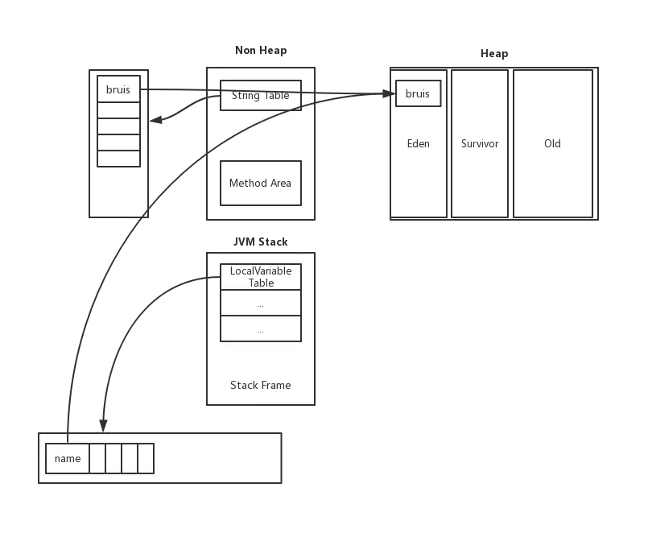
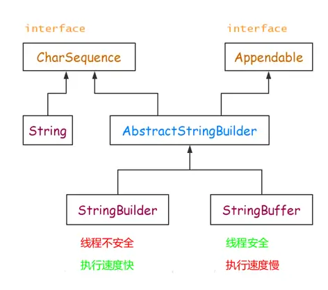

# 字符串处理笔记

### String 字符串常量

`String` 的值是不可变的，导致每次对 `String` 进行操作都会生成**新的对象**，因此**效率最低，浪费内存**
```Java
String s = "a" ; // 创建了一个字符串
s = s + "b" ;    
// 实际上已经丢弃了原来的字符串，现在又产生了一个字符串 s + "b"（即"ab"）
// 如果多次执行改变字符串内容的操作，会导致大量副本String对象留在内存中
// 降低效率，如果放在循环中，会极大影响循环效率
```

字符串可以赋值为 `null`，

### StringBuilder 字符串变量

#### 特点

优点：

* **可变**字符序列
* **效率最高**

缺点：

* 线程不安全

#### 字符串常量池

* 字符串常量池在每个VM中只有一份，存放的是字符串常量的**引用**
* 符串池里的内容是在类加载完成，经过验证，准备阶段之后在堆中生成字符串对象实例的引用
* 具体的实例对象是在堆中开辟的一块空间存放的

#### 创建字符串

1. 使用字面量（例如：`String str = "abc"`，这里的 `"abc"` 就是字面量）  
（1）如果字符串常量池中没有值： 则直接创建字符串，并将值存入字符串常量池中对于字面量形式创建出来的字符串，JVM会在编译期时对其进行优化并将字面量值存放在字符串常量池中。运行期在**虚拟机栈栈帧**中的局部变量表里创建一个name局部变量，然后指向字符串常量池中的值，如图所示：
  
（2）如果字符常量池中存在字面量值，此时要看这个是真正的**字符串值**还是**引用**。如果是字符串值则将局部变量指向常量池中的值；否则指向引用指向的地方。比如常量池中的值时指向堆中的引用，则name变量为将指向堆中的引用，如图所示：  
  

2. 使用new的方式创建字符串  
首先在堆中new出一个对象，然后常量池中创建一个指向堆中"bruis"的引用。

#### String的intern方法

当调用intern()方法时，**如果字符串常量池中包含该字符串，则直接返回字符串常量池中的字符串。否则将此String对象添加到字符串常量池中，并返回对此String对象的引用**。
```Java
String a1 = new String("AA") + new String("BB");
System.out.println("a1 == a1.intern() " + (a1 == a1.intern()));

String test = "ABABCDCD"; // 存入的是字面量值而不是引用
String a2 = new String("ABAB") + new String("CDCD");
String a3 = "ABAB" + "CDCD";
System.out.println("a2 == a2.intern() " + (a2 == a2.intern()));
System.out.println("a2 == a3 " + (a2 == a3));
System.out.println("a3 == a2.intern() " + (a3 == a2.intern()));

// a1 == a1.intern() true
// a2 == a2.intern() false
// a2 == a3 false
// a3 == a2.intern() true
```

#### 编译器的优化

* 常量可以被认为运行时不可改变，所以编译时被以常量折叠方式优化
* 变量和动态生成的常量必须在运行时确定值，所以不能在编译期折叠优化


#### 源码

实现接口
```Java
public final class String implements java.io.Serializable, Comparable<String>, CharSequence {...}
// java.io.Serializable 这个序列化接口没有任何方法和域，仅用于标识序列化的语意
// Comparable<String> 这个接口只有一个compareTo(T 0)接口，用于对两个实例化对象比较大小
// CharSequence 这个接口是一个只读的字符序列。包括length(), charAt(int index), subSequence(int start, int end)这几个API接口，StringBuffer和StringBuild也是实现了改接口
```

主要变量
```Java
/** The value is used for character storage. */
private final char value[];

/** Cache the hash code for the string */
// 因为String经常被用于比较，保存hashcode不必重复计算
private int hash; // Default to 0

// 持有一个静态内部类，用于忽略大小写得比较两个字符串
public static final Comparator<String> CASE_INSENSITIVE_ORDER = new CaseInsensitiveComparator();
```

内部类
```Java
// 该类用于忽略大小写比较字符串
// 因为String类提供一个变量：CASE_INSENSITIVE_ORDER 来持有这个内部类，这样当要比较两个String时可以通过这个变量来调用
// compareToIgnoreCase方法其实就是调用这个内部类里面的方法实现的
// 这就是代码复用的一个例子。
private static class CaseInsensitiveComparator implements Comparator<String>, java.io.Serializable {
    // use serialVersionUID from JDK 1.2.2 for interoperability
    private static final long serialVersionUID = 8575799808933029326L;

    public int compare(String s1, String s2) {
        int n1 = s1.length();
        int n2 = s2.length();
        int min = Math.min(n1, n2);
        for (int i = 0; i < min; i++) {
            char c1 = s1.charAt(i);
            char c2 = s2.charAt(i);
            if (c1 != c2) {
                c1 = Character.toUpperCase(c1);
                c2 = Character.toUpperCase(c2);
                if (c1 != c2) {
                    c1 = Character.toLowerCase(c1);
                    c2 = Character.toLowerCase(c2);
                    if (c1 != c2) {
                        // No overflow because of numeric promotion
                        return c1 - c2;
                    }
                }
            }
        }
        return n1 - n2;
    }

    /** Replaces the de-serialized object. */
    private Object readResolve() { return CASE_INSENSITIVE_ORDER; }
}
```

方法
```Java
public String() {
    this.value = "".value;
}
public int length() {
    return value.length;
}

public boolean isEmpty() {
    return value.length == 0;
}

public char charAt(int index) {
    if ((index < 0) || (index >= value.length)) {
        throw new StringIndexOutOfBoundsException(index);
    }
    return value[index];
}

//返回指定索引的代码点
public int codePointAt(int index) {
    if ((index < 0) || (index >= value.length)) {
        throw new StringIndexOutOfBoundsException(index);
    }
    return Character.codePointAtImpl(value, index, value.length);
}
//返回指定索引前一个代码点
public int codePointBefore(int index) {
    int i = index - 1;
    if ((i < 0) || (i >= value.length)) {
        throw new StringIndexOutOfBoundsException(index);
    }
    return Character.codePointBeforeImpl(value, index, 0);
}
//返回指定起始到结束段内字符个数
public int codePointCount(int beginIndex, int endIndex) {
    if (beginIndex < 0 || endIndex > value.length || beginIndex > endIndex) {
        throw new IndexOutOfBoundsException();
    }
    return Character.codePointCountImpl(value, beginIndex, endIndex - beginIndex);
}
//返回指定索引加上codepointOffset后得到的索引值
public int offsetByCodePoints(int index, int codePointOffset) {
    if (index < 0 || index > value.length) {
        throw new IndexOutOfBoundsException();
    }
    return Character.offsetByCodePointsImpl(value, 0, value.length,
            index, codePointOffset);
}
// 增补字符：代码点在 U+10000 至 U+10FFFF 范围之间的字符，也就是那些使用原始的 Unicode 的 16 位设计无法表示的字符。
// BMP：从 U+0000 至 U+FFFF 之间的字符集有时候被称为基本多语言面 （BMP Basic Multilingual Plane ）。
// 因此，每一个 Unicode 字符要么属于 BMP，要么属于增补字符。
```


### StringBuffer 字符串变量

优点：

* 可变字符序列
* **线程安全，可用于多线程**

缺点：

* 效率较低

### 三者关系

* 三者继承关系  


* 速度： StringBuilder > StringBuffer > String


### 参考文献

* [String,StringBuffer与StringBuilder的区别](https://blog.csdn.net/weixin_41101173/article/details/79677982)
* [Java-- String源码分析](https://www.cnblogs.com/listenfwind/p/8450241.html)
* [深入学习String源码与底层（一）](https://blog.csdn.net/CoderBruis/article/details/94884673)