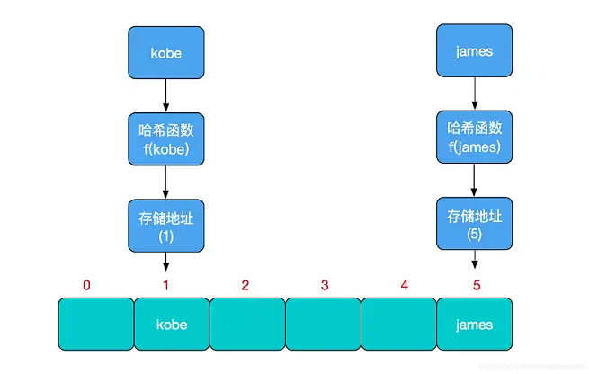
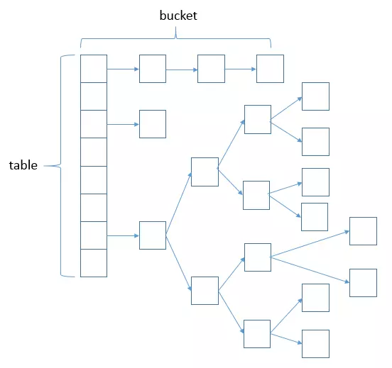
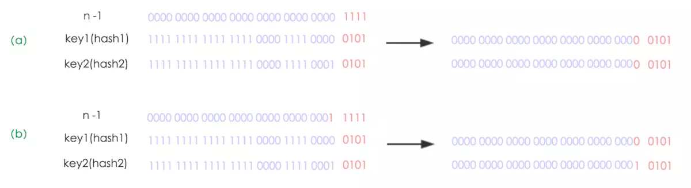
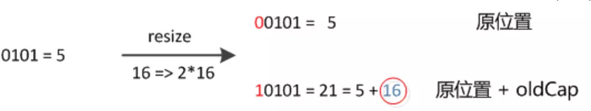
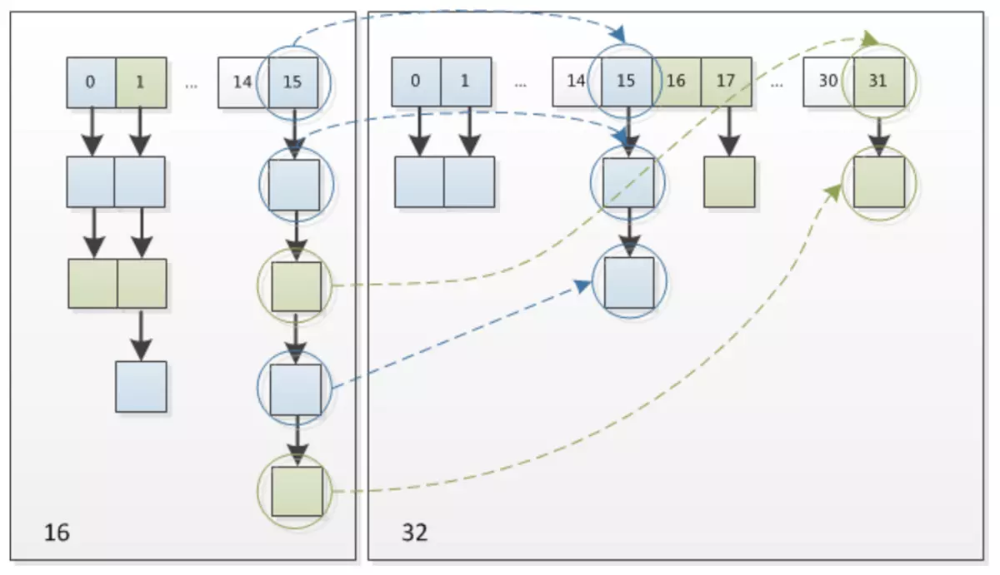
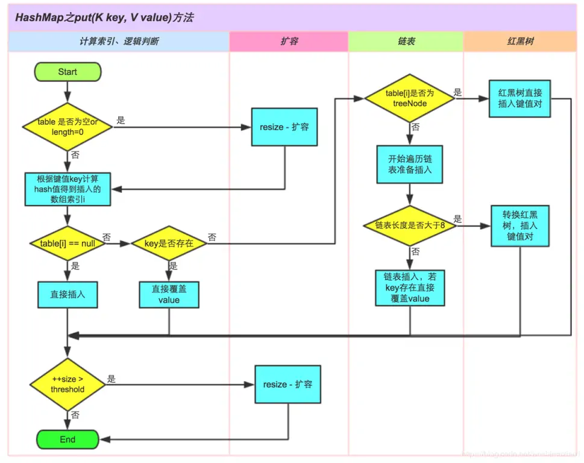

# HashMap 笔记

### 什么是哈希表

**哈希表**：哈希表的主干是数组，当要新增或查找某个元素，会把当前元素的关键字通过哈希函数映射到数组中的某个位置，通过数组下标一次定位即可完成操作


**哈希冲突**：如果两个不同的元素，通过哈希函数得出的实际存储地址相同，就产生了哈希冲突，又称哈希碰撞，好的哈希函数会尽可能地保证**计算简单**和**散列地址分布均匀**，解决哈希冲突的方案有：开放定址法（发生冲突继续寻找下一块没有被占用的存储地址），再散列函数法，链地址法等。HashMap 采用了**链地址法**，即数组+链表的方式。

### HashMap 实现原理

#### HashMap 结构
HashMap 的主干是一个 Node 数组，每一个 Node 是包含一个 key-value 对。
```Java
// HashMap 的主干数组，可以看到就是一个Node数组，初始值为空数组{}，主干数组的长度一定是2的次幂
transient Node<K,V>[] table;

// Node是HashMap的一个静态内部类
static class Node<K,V> implements Map.Entry<K,V> {
    final K key;
    V value;
    // 存储指向下一个Entry的引用，单链表结构
    Node<K,V> next;
    // 对key的hashcode值进行hash运算后得到的值，存储在Entry，避免重复计算
    final int hash;
    
    Node(int hash, K key, V value, Node<K,V> next) {
        this.hash = hash;
        this.key = key;
        this.value = value;
        this.next = next;
    }
}
```

HashMap的总体结构如下：


#### 重要字段说明：
```Java
/**实际存储key，value的数组，只不过key，value被封装成Node了*/
transient Node<K,V>[] table;

/**实际存储的key-value键值对的个数*/
transient int size;

/**阈值
当table == {}时，该值为初始容量（初始容量默认为16）；
当table被分配内存空间后，threshold一般为 capacity*loadFactory。
HashMap在进行扩容时需要参考threshold
*/
int threshold;

/**负载因子
代表了table的填充度有多少，默认是0.75
用于减缓哈希冲突，如果初始桶为16，等到满16个元素才扩容，某些桶里可能就有不止一个元素了。所以加载因子默认为0.75，也就是说大小为16的HashMap，到了第13个元素，就会扩容成32。
*/
final float loadFactor;

/**HashMap被改变的次数
由于HashMap非线程安全，在对HashMap进行迭代时，如果期间其他线程的参与导致HashMap的结构发生变化了（比如put，remove等操作），需要抛出异常ConcurrentModificationException*/
transient int modCount;
```
#### 构造函数

在常规构造函数中，没有为数组table分配内存空间（有一个入参为指定Map的构造器例外），而是在**执行put操作的时候才真正构建table数组**
```Java
public HashMap() {
    this.loadFactor = DEFAULT_LOAD_FACTOR; 
}

public HashMap(int initialCapacity) {
    this(initialCapacity, DEFAULT_LOAD_FACTOR);
}
    
public HashMap(int initialCapacity, float loadFactor) {
	// 检查参数
	// 在无参构造函数中，默认初始容量为16，默认负载因子为0.75
 	// 此处对传入的初始容量进行校验，最大不能超过MAXIMUM_CAPACITY
    if (initialCapacity < 0)
        throw new IllegalArgumentException("Illegal initial capacity: "
         								+ initialCapacity);
    if (initialCapacity > MAXIMUM_CAPACITY)
        initialCapacity = MAXIMUM_CAPACITY;
    if (loadFactor <= 0 || Float.isNaN(loadFactor))
        throw new IllegalArgumentException("Illegal load factor: " +
                                           loadFactor);

    this.loadFactor = loadFactor;
    // 返回一个比给定整数大且最接近的2的幂次方整数，如给定10，返回2的4次方16.
	this.threshold = tableSizeFor(initialCapacity);
}

// 最大容量
// static final int MAXIMUM_CAPACITY = 1 << 30;


// tableSizeFor实现
static final int tableSizeFor(int cap) {
	// cap已经是2的幂时，减一后继续算
    int n = cap - 1;
    // 以下操作保证为1的最高位后面全部为1
    n |= n >>> 1;
    n |= n >>> 2;
    n |= n >>> 4;
    n |= n >>> 8;
    n |= n >>> 16;
    // 最后加1满足要求
    return (n < 0) ? 1 : (n >= MAXIMUM_CAPACITY) ? MAXIMUM_CAPACITY : n + 1;
}
```

以Map为参数构造HashMap
```Java
// 构造一个和指定Map有相同mappings的HashMap，初始容量能充足的容下指定的Map,负载因子为0.75
public HashMap(Map<? extends K, ? extends V> m) {
    this.loadFactor = DEFAULT_LOAD_FACTOR;
    putMapEntries(m, false);
}

// 将m的所有元素存入本HashMap实例中
final void putMapEntries(Map<? extends K, ? extends V> m, boolean evict) {
    int s = m.size();
    // 当 m 中有元素时，则需将map中元素放入本HashMap实例。
    if (s > 0) {
        // 判断table是否已经初始化，如果未初始化，则先初始化一些变量。（table初始化是在put时）
        if (table == null) {
            // 根据待插入的map 的 size 计算要创建的　HashMap 的容量。
            float ft = ((float)s / loadFactor) + 1.0F;
            int t = ((ft < (float)MAXIMUM_CAPACITY) ?
                     (int)ft : MAXIMUM_CAPACITY);
            // 把要创建的　HashMap 的容量存在　threshold　中
            if (t > threshold)
                threshold = tableSizeFor(t);
        }
        // 如果table初始化过，因为别的函数也会调用它，所以有可能HashMap已经被初始化过了
        // 若size大于threshold，则先进行resize()扩容
        else if (s > threshold)
            resize();
        // 插入元素
        for (Map.Entry<? extends K, ? extends V> e : m.entrySet()) {
            K key = e.getKey();
            V value = e.getValue();
            // put(K,V)也是调用　putVal　函数进行元素的插入
            putVal(hash(key), key, value, false, evict);
        }
    }
}


// key 的 hash值的计算是通过hashCode()的高16位异或低16位实现的：
// (h = k.hashCode()) ^ (h >>> 16)
// 主要是从速度、功效、质量来考虑的，这么做可以在数组table的length比较小的时候
// 也能保证考虑到高低Bit都参与到Hash的计算中，同时不会有太大的开销
static final int hash(Object key) {
    int h;
    return (key == null) ? 0 : (h = key.hashCode()) ^ (h >>> 16);
}
// 这样做的好处是，可以将hashcode高位和低位的值进行混合做异或运算
// 而且混合后，低位的信息中加入了高位的信息，这样高位的信息被变相的保留了下来
// 掺杂的元素多了，那么生成的hash值的随机性会增大。
```

#### resize() 的实现
```Java
    final Node<K,V>[] resize() {
        // 保存当前table
        Node<K,V>[] oldTab = table;
        // 保存当前table的容量
        int oldCap = (oldTab == null) ? 0 : oldTab.length;
        // 保存当前阈值
        int oldThr = threshold;
        // 初始化新的table容量和阈值 
        int newCap, newThr = 0;
        
        // 如果原来的表非空
        if (oldCap > 0) {
            // 若旧table容量已超过最大容量，更新阈值为Integer.MAX_VALUE（最大整形值），这样以后就不会自动扩容了。
            if (oldCap >= MAXIMUM_CAPACITY) {
                threshold = Integer.MAX_VALUE;
                return oldTab;
            }
             // 容量翻倍，使用左移，效率更高
            else if ((newCap = oldCap << 1) < MAXIMUM_CAPACITY &&
                     oldCap >= DEFAULT_INITIAL_CAPACITY)
                // 阈值翻倍
                newThr = oldThr << 1;
        }
        // 用户使用的构造函数为
        // HashMap(int initialCapacity, float loadFactor) 或 
        // HashMap(int initialCapacity)或 
        // HashMap(Map<? extends K, ? extends V> m)
        // 导致 oldTab 为 null，oldCap 为0， oldThr 为用户指定的 HashMap的初始容量。
        else if (oldThr > 0) // initial capacity was placed in threshold
            // 当table没初始化时，threshold持有初始容量
            newCap = oldThr;
        // 用户调用 HashMap()构造函数创建的　HashMap，所有值均采用默认值
        // oldTab（Table）表为空，oldCap为0，oldThr等于0
        else { // zero initial threshold signifies using defaults
            newCap = DEFAULT_INITIAL_CAPACITY;
            newThr = (int)(DEFAULT_LOAD_FACTOR * DEFAULT_INITIAL_CAPACITY);
        }
        // 新阈值为0
        if (newThr == 0) {
            float ft = (float)newCap * loadFactor;
            newThr = (newCap < MAXIMUM_CAPACITY && ft < (float)MAXIMUM_CAPACITY ?
                      (int)ft : Integer.MAX_VALUE);
        }
        threshold = newThr;
        @SuppressWarnings({"rawtypes","unchecked"})
        // 初始化table
        Node<K,V>[] newTab = (Node<K,V>[])new Node[newCap];
        table = newTab;
        if (oldTab != null) {
            // 把 oldTab 中的节点　reHash 到　newTab 中去
            for (int j = 0; j < oldCap; ++j) {
                Node<K,V> e;
                if ((e = oldTab[j]) != null) {
                    oldTab[j] = null;
                    // 若节点是单个节点，直接在 newTab　中进行重定位
                    if (e.next == null)
                        newTab[e.hash & (newCap - 1)] = e;
                    // 若节点是　TreeNode 节点，要进行 红黑树的 rehash　操作
                    else if (e instanceof TreeNode)
                        ((TreeNode<K,V>)e).split(this, newTab, j, oldCap);
                    // 若是链表，进行链表的 rehash　操作
                    else { // preserve order
                        Node<K,V> loHead = null, loTail = null;
                        Node<K,V> hiHead = null, hiTail = null;
                        Node<K,V> next;
                        // 将同一桶中的元素根据(e.hash & oldCap)是否为0进行分割，分成两个不同的链表，完成rehash
                        do {
                            next = e.next;
                            // 根据算法　e.hash & oldCap 判断节点位置rehash　后是否发生改变
                            // 最高位==0，这是索引不变的链表。
                            if ((e.hash & oldCap) == 0) { 
                                if (loTail == null)
                                    loHead = e;
                                else
                                    loTail.next = e;
                                loTail = e;
                            }
                            //最高位==1 （这是索引发生改变的链表）
                            else {  
                                if (hiTail == null)
                                    hiHead = e;
                                else
                                    hiTail.next = e;
                                hiTail = e;
                            }
                        } while ((e = next) != null);
                        if (loTail != null) {   // 原bucket位置的尾指针不为空(即还有node)  
                            loTail.next = null; // 链表最后得有个null
                            newTab[j] = loHead; // 链表头指针放在新桶的相同下标(j)处
                        }
                        if (hiTail != null) {
                            hiTail.next = null;
                            // rehash　后节点新的位置一定为原来基础上加上　oldCap，具体解释看下图
                            newTab[j + oldCap] = hiHead;
                        }
                    }
                }
            }
        }
        return newTab;
    }
}
```
我们使用的是2次幂的扩展(指长度扩为原来2倍)，所以，元素的位置要么是在原位置，要么是在原位置再移动2次幂的位置。下图n为table的长度，图（a）表示扩容前的key1和key2两种key确定索引位置的示例，图（b）表示扩容后key1和key2两种key确定索引位置的示例，其中hash1是key1对应的哈希与高位运算结果。（图片引自美团点评技术博客）

元素在重新计算hash之后，因为n变为2倍，那么n-1的mask范围在高位多1bit(红色)，因此新的index就会发生这样的变化

因此，在扩充HashMap的时候，只需要看看原来的hash值新增的那个bit是1还是0就好了，是0的话索引没变，是1的话索引变成“原索引+oldCap”，下图为16扩充为32的resize示意图


#### put操作的实现
```Java
public V put(K key, V value) {
    return putVal(hash(key), key, value, false, true);
}

// 实现put和相关方法。
final V putVal(int hash, K key, V value, boolean onlyIfAbsent, boolean evict) {
    Node<K,V>[] tab; Node<K,V> p; int n, i;
    // 如果table为空或者长度为0，则resize()
    if ((tab = table) == null || (n = tab.length) == 0)
        n = (tab = resize()).length;
    // 确定插入table的位置，算法是(n - 1) & hash，在n为2的幂时，相当于取摸操作
    // 找到key值对应的槽并且是第一个，直接加入
    if ((p = tab[i = (n - 1) & hash]) == null)
        tab[i] = newNode(hash, key, value, null);
    // 在table的i位置发生碰撞，有两种情况，
    // 1. key值是一样的，替换value值，
    // 2. key值不一样的有两种处理方式：
    //    2.1 存储在i位置的链表；
    //    2.2 存储在红黑树中
    else {
        Node<K,V> e; K k;
        // 第一个node的hash值即为要加入元素的hash
        if (p.hash == hash &&
            ((k = p.key) == key || (key != null && key.equals(k))))
            e = p;
        // 2.2
        else if (p instanceof TreeNode)
            e = ((TreeNode<K,V>)p).putTreeVal(this, tab, hash, key, value);
        // 2.1
        else {
            // 遍历链表
            for (int binCount = 0; ; ++binCount) {
            // 链表的尾端也没有找到key值相同的节点，则生成一个新的Node,
            // 并且判断链表的节点个数是不是到达转换成红黑树的上界达到，则转换成红黑树。
                if ((e = p.next) == null) {
                    // 创建链表节点并插入尾部
                    p.next = newNode(hash, key, value, null);
                    // 超过了链表的设置长度8就转换成红黑树
                    if (binCount >= TREEIFY_THRESHOLD - 1) // -1 for 1st
                        treeifyBin(tab, hash);
                    break;
                }
                if (e.hash == hash &&
                    ((k = e.key) == key || (key != null && key.equals(k))))
                    break;
                p = e;
            }
        }
        // 如果e不为空就替换旧的oldValue值
        if (e != null) { // existing mapping for key
            V oldValue = e.value;
            if (!onlyIfAbsent || oldValue == null)
                e.value = value;
            afterNodeAccess(e);
            return oldValue;
        }
    }
    ++modCount;
    if (++size > threshold)
        resize();
    afterNodeInsertion(evict);
    return null;
}
```

#### get() 实现
```Java
// 实现get和相关方法
public V get(Object key) {
    Node<K,V> e;
    return (e = getNode(hash(key), key)) == null ? null : e.value;
}

final Node<K,V> getNode(int hash, Object key) {
    Node<K,V>[] tab; Node<K,V> first, e; int n; K k;
    // 判断数组是否为null或空
    if ((tab = table) != null && (n = tab.length) > 0 &&
        (first = tab[(n - 1) & hash]) != null) {
        if (first.hash == hash && // always check first node
            ((k = first.key) == key || (key != null && key.equals(k))))
            return first;
        if ((e = first.next) != null) {
            if (first instanceof TreeNode)
                return ((TreeNode<K,V>)first).getTreeNode(hash, key);
            do {
                if (e.hash == hash &&
                    ((k = e.key) == key || (key != null && key.equals(k))))
                    return e;
            } while ((e = e.next) != null);
        }
    }
    return null;
}
```
算法流程：  
1. 通过 hash & (table.length - 1)获取该key对应的数据节点的位置;
2. 判断首节点是否为空, 为空则直接返回空;
3. 再判断首节点.key 是否和目标值相同, 相同则直接返回(首节点不用区分链表还是红黑树);
4. 首节点.next为空, 则直接返回空;
5. 首节点是树形节点, 则进入红黑树数的取值流程, 并返回结果;
6. 进入链表的取值流程, 并返回结果;


### HashMap 什么时候会强制扩容

1. 元素个数达到阈值的时候发生扩容
2. 在树形化之前检查数组长度发现数组长度过短（JDK1.8加入了红黑树使用尾插法处理链表过长问题）

### 什么情况会导致 hash 冲突

1. 两节点key 值相同（hash值一定相同），导致冲突；
2. 两节点key 值不同，由于 hash 函数的局限性导致hash 值相同，冲突；
3. 两节点key 值不同，hash 值不同，但 hash 值对数组长度取模后相同，冲突；

### 为什么 HashMap 的数组长度一定是2的次幂
Hash算法的本质是取模，即hash%length，但是计算机中直接求余效率不如位移运算，源码中做了优化 hash&(length-1)，而**hash%length==hash&(length-1) 的前提是 length 是2的n次方**；

为什么这样能均匀分布减少碰撞呢？2的n次方实际就是1后面n个0，2的n次方-1  实际就是n个1；
例如长度为9时候，3&(9-1)=0  2&(9-1)=0 ，都在0上，碰撞了；
例如长度为8时候，3&(8-1)=3  2&(8-1)=2 ，不同位置上，不碰撞；

### 当两个对象的hashcode相同会发生什么
因为hashcode相同，所以它们的bucket位置相同，‘碰撞’会发生。因为HashMap使用链表存储对象，这个Entry(包含有键值对的Map.Entry对象)会存储在链表中。  
这个时候要理解根据hashcode来划分的数组，如果数组的坐标相同，则进入链表这个数据结构中了。**jdk1.7及以前为头插法，jdk1.8之后是尾插法，在jdk1.8之后，当链表长度到达8的时候，jdk1.8上升为红黑树*。*

### 如果两个键的hashcode相同，你如何获取值对象
当我们调用get()方法，HashMap会使用键对象的hashcode找到bucket位置，然后获取值对象，如果有两个值对象储存在同一个bucket，将会遍历链表直到找到值对象。找到bucket位置之后，会调用keys.equals()方法去找到链表或红黑树中正确的节点，最终找到要找的值对象。

### 你了解重新调整HashMap大小存在什么问题吗
当重新调整HashMap大小的时候，确实存在条件竞争，因为如果两个线程都发现HashMap需要重新调整大小了，它们会同时试着调整大小。在调整大小的过程中，存储在链表中的元素的次序会反过来，因为移动到新的bucket位置的时候，HashMap并不会将元素放在链表的尾部，而是放在头部，这是为了避免尾部遍历(tail traversing)，原数组 j 位置上的桶移到了新数组 j+原数组长度 的位置上 。如果条件竞争发生了，那么就死循环了。详见[老生常谈，HashMap的死循环](https://www.jianshu.com/p/1e9cf0ac07f4)

### HashMap 为什么是线程不安全的
HashMap 在并发时可能出现的问题主要是两方面：

1. put的时候导致的多线程**数据不一致**。例如有两个线程A和B，首先A希望插入一个key-value对到HashMap中，首先计算记录所要落到的 hash桶的索引坐标，然后获取到该桶里面的链表头结点，此时线程A的时间片用完了，而此时线程B被调度得以执行，和线程A一样执行，只不过线程B成功将记录插到了桶里面，假设线程A插入的记录计算出来的 hash桶索引和线程B要插入的记录计算出来的 hash桶索引是一样的，那么当线程B成功插入之后，线程A再次被调度运行时，它依然持有过期的链表头但是它对此一无所知，以至于它认为它应该这样做，如此一来就覆盖了线程B插入的记录，这样线程B插入的记录就凭空消失了，造成了数据不一致的行为。
2. **resize而引起死循环**。这种情况发生在HashMap自动扩容时，当2个线程同时检测到元素个数超过 数组大小 × 负载因子。此时2个线程会在put()方法中调用了resize()，两个线程同时修改一个链表结构会产生一个循环链表（JDK1.7中，会出现resize前后元素顺序倒置的情况）。接下来再想通过get()获取某一个元素，就会出现死循环。

### HashMap 和 HashTable 的区别

主要的区别有：线程安全性，同步(synchronization)，以及速度。

* HashMap可以接受为null的键值(key)和值(value)，而Hashtable则不行
* HashMap是非synchronized，而Hashtable是synchronized
* Hashtable是线程安全的（因为它是synchronized的），多个线程可以共享一个Hashtable，而HashMap不行。**Java 5提供了ConcurrentHashMap，它是HashTable的替代，比HashTable的扩展性更好**。
* HashMap的迭代器(Iterator)是fail-fast迭代器，而Hashtable的enumerator迭代器不是fail-fast的。所以当有其它线程改变了HashMap的结构（增加或者移除元素），将会抛出ConcurrentModificationException，但迭代器本身的remove()方法移除元素则不会抛出ConcurrentModificationException异常。但这并不是一个一定发生的行为，要看JVM。这条同样也是Enumeration和Iterator的区别。
* HashMap性能要好过Hashtable。
* HashMap不能保证随着时间的推移Map中的元素次序是不变的。

涉及到的术语

1. sychronized意味着在一次仅有一个线程能够更改Hashtable。就是说任何线程要更新Hashtable时要首先获得同步锁，其它线程要等到同步锁被释放之后才能再次获得同步锁更新Hashtable。
2. Fail-safe和iterator迭代器相关。如果某个集合对象创建了Iterator或者ListIterator，然后其它的线程试图“结构上”更改集合对象，将会抛出ConcurrentModificationException异常。但其它线程可以通过set()方法更改集合对象是允许的，因为这并没有从“结构上”更改集合。但是假如已经从结构上进行了更改，再调用set()方法，将会抛出IllegalArgumentException异常。
3. 结构上的更改指的是删除或者插入一个元素，这样会影响到map的结构。

HashMap可以通过下面的语句进行同步：
`Map m = Collections.synchronizeMap(hashMap);`

### 重写equals方法需同时重写hashCode方法
这是一种规范：如果两个对象根据equals方法比较是相等的，那么调用这两个对象的任意一个hashcode方法都必须产生相同的结果。

**1. equal()相等的两个对象他们的hashCode()肯定相等，也就是用equal()对比是绝对可靠的。**
**2. hashCode()相等的两个对象他们的equal()不一定相等，也就是hashCode()不是绝对可靠的。**

所以解决方式是，每当需要对比的时候，首先用hashCode()去对比，**如果hashCode()不一样，则表示这两个对象肯定不相等**（也就是不必再用equal()去再对比了）**,如果hashCode()相同，此时再对比他们的equal()**，如果equal()也相同，则表示这两个对象是真的相同了，这样既能大大提高了效率也保证了对比的绝对正确性！

### JDK1.8 中 HashMap 的性能优化
JDK1.8在JDK1.7的基础上针对增加了红黑树来进行优化。即当链表超过8时，链表就转换为红黑树，利用红黑树快速增删改查的特点提高HashMap的性能，其中会用到红黑树的插入、删除、查找等算法。


### 参考文献

* [深入浅出学Java——HashMap](https://blog.csdn.net/woshimaxiao1/article/details/83661464)
* [一文读懂HashMap](https://www.jianshu.com/p/ee0de4c99f87)
* [HashMap源码解析JDK1.8](https://blog.csdn.net/m0_37914588/article/details/82287191)
* [HashMap的长度为什么要是2的n次方](https://blog.csdn.net/sidihuo/article/details/78489820)
* [hashcode（）和equals（）的作用、区别、联系](https://www.cnblogs.com/keyi/p/7119825.html)
* [HashMap面试常问问题](https://blog.csdn.net/weixin_42636552/article/details/82016183)

